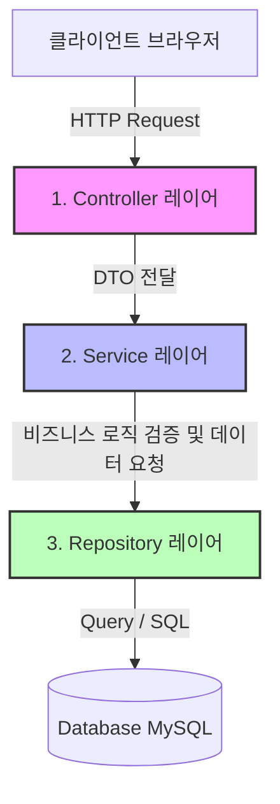

# 시스템 아키텍처 및 레이어 구성

이 문서는 Meerkatgram 프로젝트의 백엔드 시스템 설계, 디렉토리 구조 및 각 레이어의 책임 범위를 상세히 설명합니다.

---

## 1. 디렉토리 구조 및 레이아웃

Meerkatgram 백엔드는 **도메인 협력형 계층 구조 (Domain-Driven Layered Architecture)**를 채택하고 있습니다. 비즈니스 도메인 단위로 폴더를 먼저 구성하고, 그 안에서 다시 기능별 레이어(Layer)를 나누는 구조입니다.

```text
src/main/java/com/msa4meerkatgram
├── domain                       # [도메인 영역] 비즈니스 로직 및 개별 기능 단위 구성
│   ├── auth                     # 1. 인증/인가 도메인
│   ├── file                     # 2. 파일 업로드/관리 도메인
│   ├── post                     # 3. 게시글 도메인
│   └── user                     # 4. 사용자 관리 도메인
└── global                       # [글로벌 영역] 시스템 전반에 공유되는 기술 설정
    ├── annotations              # 공통/커스텀 어노테이션 (예: Swagger OpenAPI 응답용)
    ├── config                   # 애플리케이션 공통 설정 (WebMvc, CORS, JPA 등)
    ├── errors                   # 전역 예외 처리 클래스 (GlobalExceptionHandler, CustomException 등)
    ├── openapi                  # API 문서 자동화(Swagger OpenAPI) 설정
    ├── responses                # 규격화된 공통 응답 구조 (GlobalRes, CustomResponseCode 등)
    └── security                 # 보안 및 인증 프레임워크 (Spring Security, JWT)
```

---

## 2. 3계층 아키텍처 (3-Tier Architecture)

도메인 디렉토리 하위는 비즈니스 요청의 흐름에 따라 명확하게 세 가지 레이어로 분리되어 있습니다.



### (1) Presentation Layer: Controller (`controllers/`)
* **역할**: 외부 클라이언트의 HTTP 요청을 가장 먼저 수신하고, 올바른 형식의 응답을 반환합니다.
* **주요 책임**:
  * API 엔드포인트 URL 매핑 (`@GetMapping`, `@PostMapping` 등)
  * 요청 파라미터 및 본문 데이터 검증 (`@Valid`, `@Validated`)
  * 반환 타입 규격화 (`ResponseEntity<GlobalRes<T>>`)
  * API 문서화를 위한 Swagger 어노테이션 정의

### (2) Business Logic Layer: Service (`services/`)
* **역할**: 실제 서비스의 비즈니스 규칙과 프로세스를 정의하고 수행합니다.
* **주요 책임**:
  * 데이터 트랜잭션 단위 정의 (`@Transactional`)
  * 핵심 로직 검증 및 커스텀 예외 던지기 (예: `DeletedRecordException`, `DuplicatedRecordException`)
  * 데이터 가공 및 여러 Repository들과의 협업 제어

### (3) Data Access Layer: Repository (`repositories/`)
* **역할**: 데이터베이스와의 직접적인 상호작용 및 쿼리 실행을 전담합니다.
* **주요 책임**:
  * **Spring Data JPA (`*Repository.java`)**: 기본적인 등록, 수정, 단순 조회 기능 수행
  * **QueryDSL (`*QueryRepository.java`)**: 복잡한 조건 검색, 대량 데이터 조회, 동적 쿼리, N+1 예방을 위한 조인 최적화 처리

---

## 3. 핵심 데이터베이스 기술 특징

### (1) Spring Data JPA & QueryDSL의 조화로운 연동
단순 조회나 변경은 JPA 기술을 활용하지만, 조인이 필요하고 복잡한 페이지네이션이 동반되는 쿼리는 성능을 고려하여 **QueryDSL**을 사용해 타입 안정성을 확보합니다.

* **N+1 문제 차단 (`fetchJoin`)**:
  게시글 목록을 불러올 때, 매 게시물마다 작성자(User)를 확인하느라 쿼리가 반복 조회되는 성능 저하 현상(N+1 문제)을 해결하기 위해 `PostQueryRepository`에서 `fetchJoin` 기법을 명시적으로 적용하였습니다.
  ```java
  // PostQueryRepository.java 예시
  public List<Post> pagination(int offset, int limit) {
      return jpaQueryFactory
              .selectFrom(post)
              .join(post.user, user).fetchJoin() // 게시글을 가져올 때 한 번의 조인 쿼리로 유저 정보도 함께 캐싱
              .orderBy(post.createdAt.desc(), post.id.desc())
              .limit(limit)
              .offset(offset)
              .fetch();
  }
  ```

### (2) 안전을 지키는 논리 삭제 (Soft Delete) 패턴
데이터를 직접 DB에서 지우지 않고 `deleted_at` 칼럼에 삭제 시간을 마킹하여 보존함으로써, 실수로 발생한 데이터 유실을 방지하고 백업 및 감사(Audit) 기능을 지원합니다.

* **적용 코드 (`Post.java` 예시)**:
  * `@SQLDelete(sql = "UPDATE posts SET deleted_at = NOW() where id = ?")`: 삭제 요청 시 `delete` 대신 `update`로 전환
  * `@SQLRestriction("deleted_at IS NULL")`: 데이터를 조회할 때 항상 삭제되지 않은 유효한 행만 필터링하여 노출

---

## 4. 공통 인프라스트럭처 아키텍처

### (1) 전역 예외 처리 & 공통 응답 포맷
시스템 내부의 예외 처리를 체계화하여 사용자에게 불필요한 시스템 스택 정보가 노출되지 않도록 전역 예외 처리기(`GlobalExceptionHandler`)를 갖추고 있습니다.

1. **예외 감지**: 컨트롤러 및 서비스에서 에러 상황 시 적절한 커스텀 예외를 던집니다.
2. **글로벌 수신**: `RestControllerAdvice`가 예외를 캐치합니다.
3. **규격화된 응답**: 응답 코드 규격(`CustomResponseCode`)에 근거하여 `GlobalRes` 규격의 일관성 있는 JSON 응답을 내려보냅니다.
   ```json
   {
     "code": "E10",
     "message": "NOT_FOUND_DATA_ERROR",
     "data": null
   }
   ```

### (2) 보안 아키텍처 (Spring Security + JWT)
기존 세션 방식의 단점인 서버 메모리 낭비를 극복하고자 **무상태(Stateless) 토큰 기반 인증**을 채택하고 있습니다.
* **Access Token**: 클라이언트의 API 요청 시 헤더에 실려 사용자의 권한을 즉시 검증합니다.
* **Refresh Token**: 서버의 보안 수준을 높이기 위해, 비교적 만료 시간이 긴 Refresh Token을 사용자의 브라우저 쿠키(HttpOnly 속성)에 저장하고, 서버 DB(`user.refresh_token`)에도 저장하여 일치 여부를 검증한 후 Access Token을 재발급합니다.
